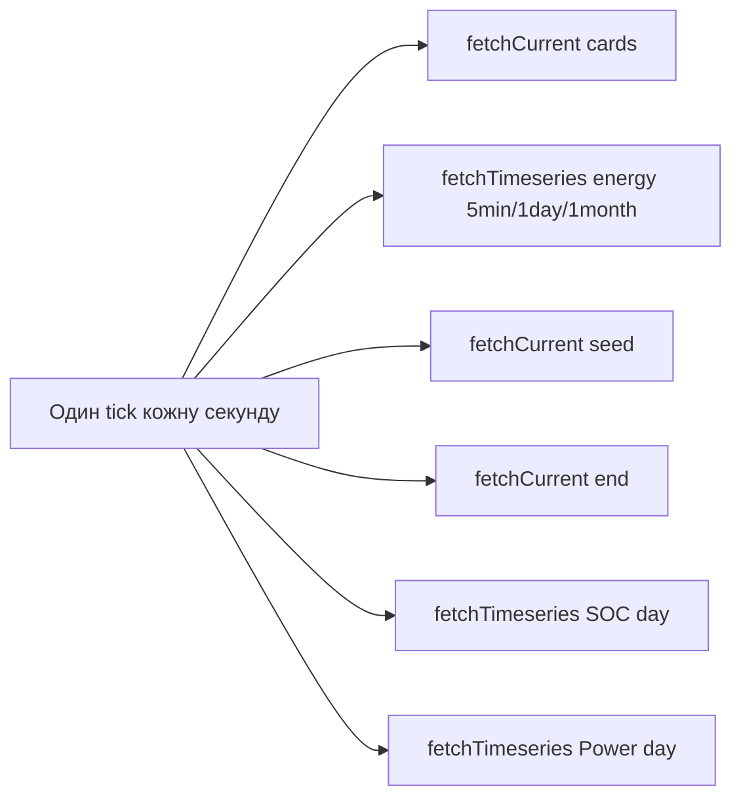
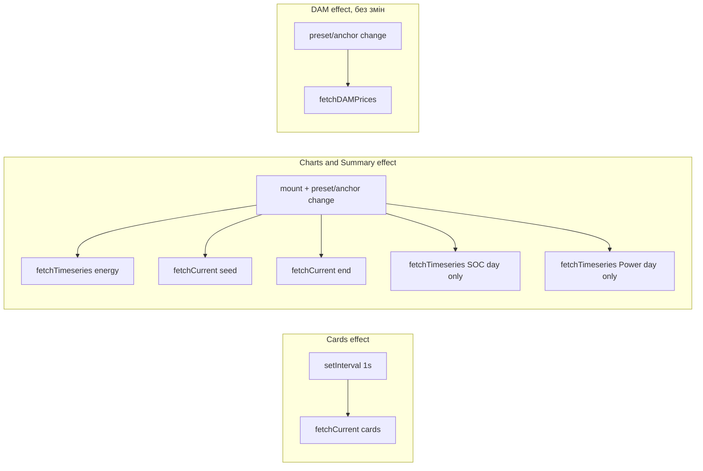

## Поточний стан

`useDashboardData` має один `useEffect` з deps `[organizationID, preset, anchorTime, metricsAtTime]`, який кожну секунду через `setInterval(tick, 1s)` робить **усі** 4-6 паралельних запитів. Навіть якщо користувач просто переглядає графік, кожна секунда — це повний batch.



## Цільовий стан



Картки тікають кожну секунду, як зараз. Графіки і підсумок — тільки коли треба.

## Зміни по файлах

### 1. [web/src/dashboard/hooks/useDashboardData.ts](web/src/dashboard/hooks/useDashboardData.ts) (основний рефакторинг)

Розділити поточний `tick()` + єдиний effect на:

**a) Cards effect** (нове)
- Deps: `[organizationID, metricsAtTime]`.
- Рукоятка: `tickCards(showLoading)` робить тільки `fetchCurrent({ organizationID, at })` і викликає `setCurrent`.
- Polling: `setInterval(() => tickCards(false), DASHBOARD_REFRESH_MS)`.
- Visibility hook лишається.
- Власний state `cardsLoading` для першого завантаження. Якщо `metricsAt != null` (історичний знімок) — після першого фетчу не запускати інтервал, бо дані не змінюються.

**b) Charts effect** (рефакторинг існуючого)
- Deps: `[organizationID, preset, anchorTime]` (без `metricsAtTime`).
- Рукоятка: `tickCharts(showLoading)` робить решту (energy + seed + end + soc + power), оновлює `energySeries`, `energySummary`, `socSeries`, `powerSeries`.
- **БЕЗ** `setInterval` — фетчиться один раз на маунт, потім тільки коли deps міняються.
- Visibility hook лишається (якщо повернувся з прихованого табу і дані застарілі — можна додати один re-fetch; опційно).
- Власний state `chartsLoading`.

**c) DAM effect** — без змін.

**d) `cur` більше не залежить від `anchorTime`** — це автоматично знімає redundant-fetch при перемиканні дня.

**e) DashboardData API**:

```ts
export type DashboardData = {
  // existing fields ...
  loading: boolean        // = chartsLoading, для EnergyChart (back-compat)
  cardsLoading: boolean   // НОВЕ, для MetricsPanel
  // ...
}
```

Щоб не ламати поточних споживачів, `loading` лишається синонімом `chartsLoading` — `EnergyChart` отримує його як зараз.

### 2. [web/src/dashboard/components/MetricsPanel.tsx](web/src/dashboard/components/MetricsPanel.tsx)

Перейти на `cardsLoading` (якщо хочемо точніше). Картки і так оновлюються гладко — alternative — взагалі прибрати loading prop.

### 3. [web/src/dashboard/Dashboard.tsx](web/src/dashboard/Dashboard.tsx)

Передати `cardsLoading` у `MetricsPanel`, `loading` (= chartsLoading) у `EnergyChart`. Один рядок змін.

### 4. [web/src/dashboard/Dashboard.test.tsx](web/src/dashboard/Dashboard.test.tsx)

У моку `useDashboardData` додати `cardsLoading: false`.

## Що вирішує

- **Backend навантаження**: ~6× менше запитів/с на активний таб (з 6 до 1).
- **Cold-cache при перемиканні дня**: DB не зайнята фоновим polling-ом → швидша відповідь на switch-запит.
- **Redundant cards refetch на switch'ах** зникає (cards-effect не залежить від anchor).
- **Картки live**: оновлюються кожну секунду, як і зараз.
- **Графіки**: тікають при mount + при зміні preset/anchor — рівно тоді, коли користувач справді хоче побачити оновлення.

## Що НЕ вирішує

- При перемиканні дня графік все одно показує `Loading...` placeholder і Recharts реініціалізується. Це окремий fix (stale-while-revalidate) — поза цим планом, опціональний follow-up.

## API impact

Per second (typical day-tab):
- Було: 6 GETs (3 timeseries + 3 current) + 1 DAM на зміну anchor.
- Стане: 1 GET (cards) щосекунди + 5 GETs тільки на mount/preset/anchor change.

Для типової сесії (5 хв перегляду одного дня): було ~1800 запитів, стане ~300+5. Зменшення на порядок.

## Тести

- Існуючий `Dashboard.test.tsx` — вирівняти мок (додати `cardsLoading`).
- Інтеграційний тест (опційно): мок-фетч, перемикання preset → перевірити, що `tickCards` не викликався, а `tickCharts` — викликався.

## Поза цим планом

- F1 (chart unmount under loading) — окремий план stale-while-revalidate.
- F2 (Promise.all блокує до найповільнішого) — частково вирішується split'ом (cards вже не блокують charts), але повністю прибрати — окрема задача.
- Backend-кешування на immutable `current?at=<past>` — окремий план.
